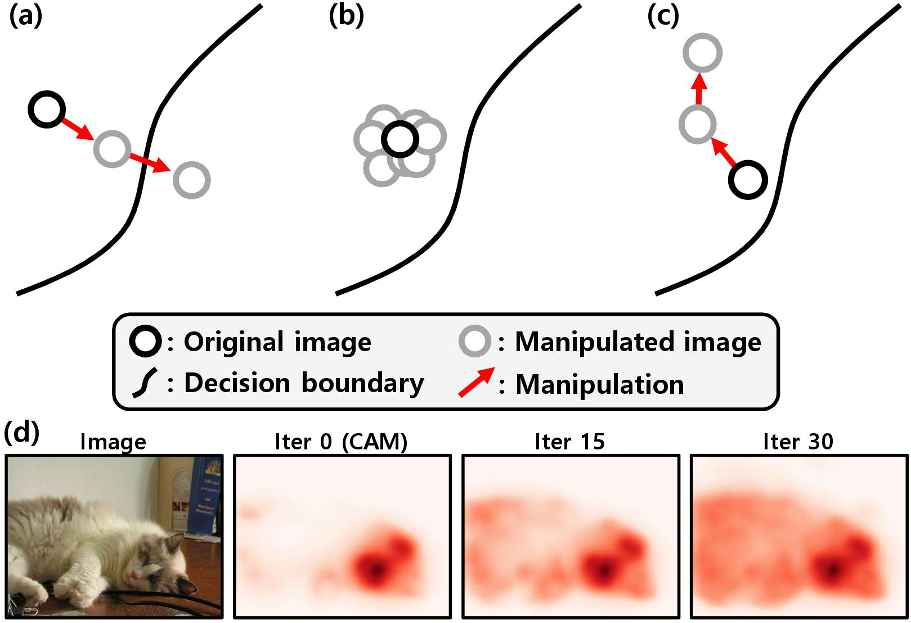

Biography
======
I'm a PhD candidate of Data Science and Artificial Intelligence Laboratory ([DSAIL](http://dsail.snu.ac.kr/)) in the Electrical & Computer Engineering department at the Seoul National University, South Korea. I received B.S. degree in Electrical Engineering from Seoul National University, South Korea, in 2017. My research interests involve deep learning applied to computer vision problem, especially **label-efficient learning** such as weakly and semi-supervised learning.

Publications
======

## 2022

  <section id="papers" class="home-section wg-papers   " style="padding: 20px 0 20px 0;" >
    

      

  
    

      <h1>Publications</h1>
    

    

        <ul class="ul-papers">
        <li>
            

              
            

          

            
TubeFormer-DeepLab: Video Mask Transformer

            
<b>Dahun Kim</b>, Jun Xie, Huiyu Wang, Siyuan Qiao, Qihang Yu, Hong-Seok Kim, 
            &nbsp;&nbsp; Hartwig Adam, In So Kweon, Liang-Chieh Chen

            
CVPR 2022  
            

            

              [
                paper
              ]
            

          

        </li>

     
        </ul>      
    
  

    

  </section>
